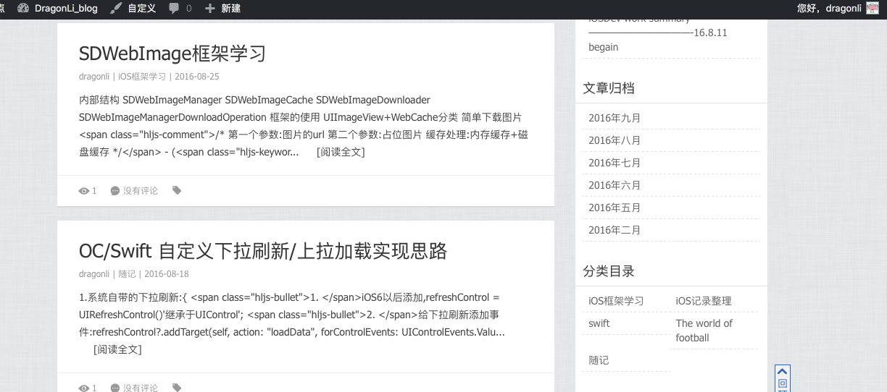

# [Blog](http://devdragonli.github.io/) 

## Earlier articles

> [webLinks](http://dragonli.tui8.com/) 

- iOS开发之RAC(ReactiveCocoa)调试

-  瑞典超初步理论分析和赛果预判测试报告

-  UIImageView 图像笔记

-  iOSDev work summary
	
- xib 編程中處理圓角,邊框等技巧篇1

- OC/Swift 自定义下拉刷新/上拉加载实现思路

- SDWebImage框架学习

## 联系 

> `dragonli_52171@163.com`
