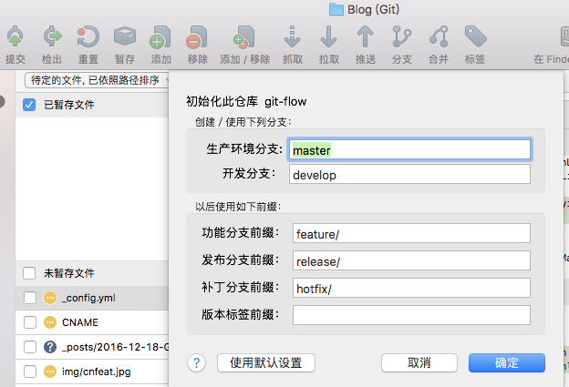

Gitflow 工作流

*  1.1  `sourceTree` 初始化工作流

 master  		  new  hotfix

 Hotfix  		  merge to  master

 Release  

 Develop  	     new master

feature 		  new  develop,merge  dev

开发新功能 使用dev作为父分支 ,没个新功能位于自己的分支

 1.1 新功能分支不可以和master分支交互
	假设新建球队  creatTeam
	点击完成,发现feature 分支已经被删除
	合并到dev分支

*  2. 发布分支 ,当dev分支完成功能合并后,建立release 1.0 只面向发布的修改 文档准备 bug 修复 
此时  `点击发布完成当前版本`  确定可以发布!

1. 打tag   比如1.0
2. 用release1.0版本,合并到master上 
3. 合并release1.0版本到dev版本 
4. 删除release1.0分支
5. 发布  最终master 和dev 分支都是目前最新代码!

* 3. 后期bug  可以从masterfork的分支,修复完成,应该马上合并奥master和dev ,分支名词 hotfix/bugname/bug no

`假设创建球队有个bug,但是在release过程中已经没了当初的分支`,此时需要

 

1.从master 打出hotfix 分支 名字 bug_问题fix 
 
 2.hotfix 修复 bug
 
 3.点击完成,为此消息打tag

